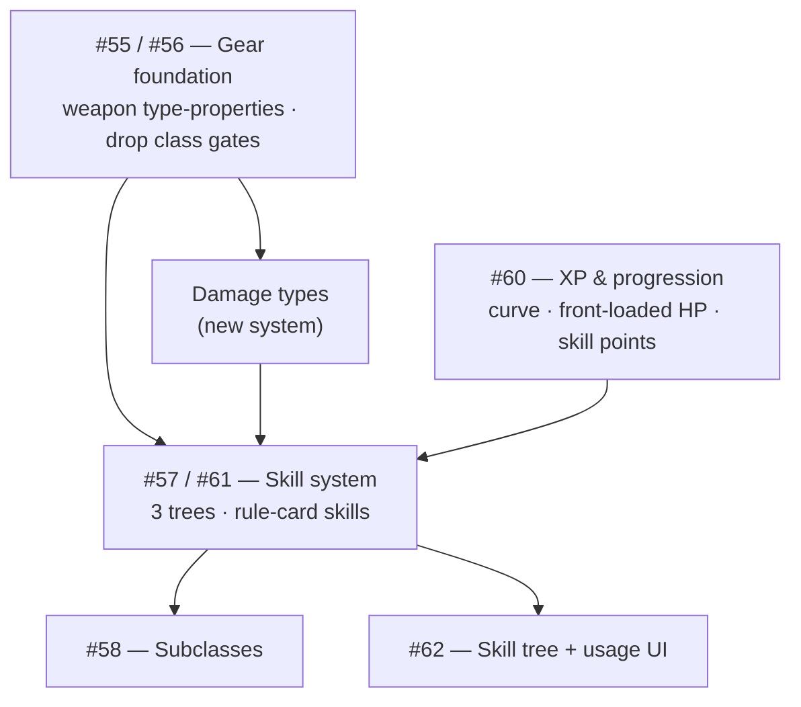

# Design roadmap — the skill & gear arc

The open design issues (#55–#62) are **one interconnected arc, not eight
separate tasks**. This maps their build-order dependencies so the backlog reads
as a sequence instead of a blob. Each is still a *design discussion* (not yet
specced) — see the issue thread for current thinking and the posted feedback.

## Dependency graph

## Build order

**1. Gear foundation — #55 + #56 (the keystone, start here).**
Weapons carry a *set* of type-properties (melee / ranged / thrown / magic /
two-handed) instead of a single `itemType`; generic hand slots replace the
per-class weapon slots; class gates on gear are dropped. This unblocks any
skill that conditions on weapon properties ("all ranged weapons"). A real but
clean refactor of today's single-`itemType` model. *(one-handed = the absence
of two-handed; don't model both.)*

**2. Damage types — new system (buildable alongside 1).**
Every attack and monster attack carries a damage type; resistances/multipliers
key on it. Needed by Fire Master / Dragon Skin (#57) and the parked Infernal
Chain Mail card. Independent enough to build in parallel with the gear
foundation.

**3. Skill system — #57 + #61 (the big one).**
Three trees (Class / Adventure / Survival) with cross-tree independence; skills
expressed as **rule cards using the existing `WHEN / IF / THEN` grammar**, so
passives fold into the combat pipeline for free. Feasibility ladder (from the
#57 thread):
- **Ready once #1 lands:** property-conditioned passives (Sharpshooter, Combat Training).
- **Needs #2:** damage-type skills (Fire Master, Dragon Skin).
- **New machinery:** active skills (targeted actions — target / cost / cooldown) and aura / other-player effects (Healing Aura) — the biggest lift.

**4. XP & progression — #60 (can start early).**
Quadratic XP curve + front-loaded HP are *just formulas* — shippable any time,
independently. The reward half (levels grant **skill points**, not stat bumps;
cut `DamagePerLevel`'s raw-stat scaling) depends on the skill system existing.

**5. Subclasses — #58 (after skills).**
Cross-class access to a *subset* of another tree, gated on a class **capstone**
(not a level number). Needs the trees to exist first.

**6. Skill UI — #62 (after the model settles).**
Tree + usage UI. Can't be designed until #61's structure is locked.

## Cheap wins that don't need the whole arc
- **XP curve + front-loaded HP** (#60) — formulas; land any time.
- **Stacking throwables** (#55 thread) — reuses the consumable-stack backpack; small.
- **Cut `DamagePerLevel`** (#60) — decide whether a level should stop inflating raw weapon damage. Small change, defines the progression philosophy.

## Not part of this arc (separate cleanup backlog)
- #27 (flaky reconnect e2e), #31, #36 — unrelated to the design arc.

## How to start a slice
Pick one — the gear foundation (#1) is the natural first — then run the normal
flow from `CLAUDE.md`: **spec → plan → pause for review → build**. Don't design
the whole arc at once; each phase is its own slice.

_Feedback on every issue is posted in-thread (the "🤖 Comment by Claude"
notes). This doc is a **map, not a decision** — the design calls are the
maintainer's / designer's._
