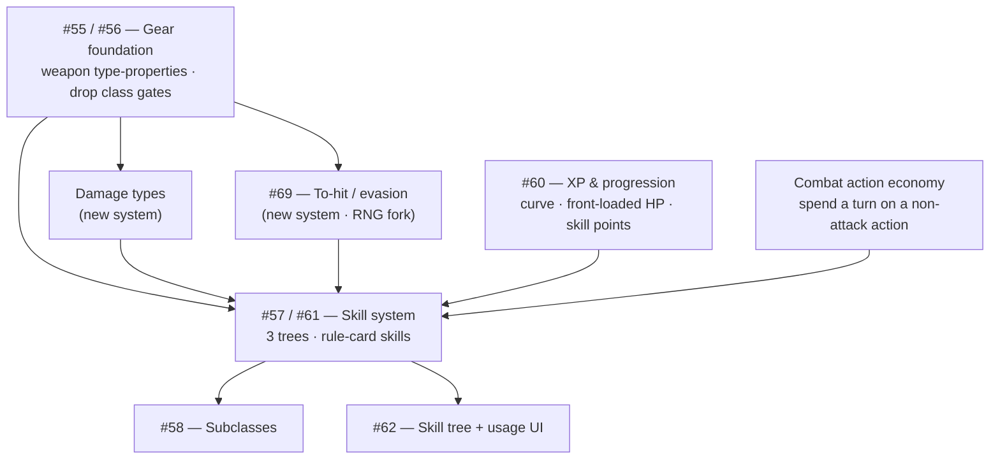

# Design roadmap & decisions — the skill & gear arc

The open design issues (#55–#62, plus the to-hit/defence thread #69) are one interconnected arc. This doc turns it
into a **decision menu**: each row is a discrete piece of work you can
green-light, cut, or shelve. Set the **Decision** column (edit this file, or
tell me and I'll record it). Once decided, each **✅ Do** becomes its own small,
pick-up-able issue that **links back to its design issue** — see *Next* at the
bottom.

- **Size:** `S` = small (hours) · `M` = a slice (spec→build) · `L` = a new system/project.
- **Decision:** `✅ do` · `❌ drop` · `⏸ later` · `❓` undecided (default).
- **Notes** carry my engineering read (cheap / keystone / big) — the *gameplay*
  calls are yours and the designer's.

## Dependency graph

## 1. Gear foundation — #55 / #56

| # | Work item | What it is | Size | Notes / deps | Decision |
|---|-----------|-----------|:----:|--------------|:--------:|
| G1 | Weapon type-properties | Weapons carry a *set* of tags (melee/ranged/thrown/magic/two-handed) instead of one `itemType` | M | **Keystone** — unblocks property-skills. `1h` = absence of `2h` | ❓ |
| G2 | Generic hand slots | Drop per-class weapon slots; any weapon fits a hand slot (two-handed greys the other) | M | Pairs with G1 | ❓ |
| G3 | Drop class gear restrictions | Anyone equips anything; class identity comes from skills, not gates (#56) | M | Philosophy shift; designer endorsed | ❓ |
| G4 | Stacking throwables | Javelins/axes stack like consumables; a throw spends one | S | **Cheap**; reuses backpack stacks | ❓ |
| G5 | Multi-mode weapons | One weapon, melee + thrown modes with per-mode damage (the "Kangaroo axe") | L | Optional flavor; needs a mode choice + per-mode damage | ❓ |

## 2. Damage types

| # | Work item | What it is | Size | Notes / deps | Decision |
|---|-----------|-----------|:----:|--------------|:--------:|
| DT1 | Damage-type system | Every attack/monster carries a damage type; resist/multipliers key on it | L | Unblocks fire gear & skills + the parked Infernal Chain Mail card | ❓ |

## 3. Skills — #57 / #61

| # | Work item | What it is | Size | Notes / deps | Decision |
|---|-----------|-----------|:----:|--------------|:--------:|
| SK1 | Skill rule-card model | Skills as `WHEN/IF/THEN` cards that fold into the combat pipeline | M | Foundation for all passives | ❓ |
| SK2 | Three-tree structure | Class / Adventure / Survival trees, cross-tree independent | M | With SK1 | ❓ |
| SK3 | Property passives | Sharpshooter (+range to ranged), Combat Training (+melee)… | M | Needs G1 | ❓ |
| SK4 | Damage-type skills | Fire Master, Dragon Skin | M | Needs DT1 | ❓ |
| SK5 | Active skills | Targeted actions (target / cost / cooldown) — a new action system | L | New machinery = the **combat action economy** (§8 `ACT`) | ❓ |
| SK6 | Aura / ally-target effects | Healing Aura (buff other players in a radius) | L | New effect targeting | ❓ |
| SK7 | Prerequisites & branching | Skills unlock skills within a tree; capstones | S–M | Part of the tree model | ❓ |

## 4. Progression — #60

| # | Work item | What it is | Size | Notes / deps | Decision |
|---|-----------|-----------|:----:|--------------|:--------:|
| XP1 | Quadratic XP curve | Fast early levels, steep late | S | **Cheap** (formula); independent | ❓ |
| XP2 | Front-loaded HP curve | HP gains fall off with level (replaces linear `HPPerLevel`) | S | **Cheap** (formula); independent | ❓ |
| XP3 | Cut `DamagePerLevel` | A level stops inflating raw weapon damage | S | Defines the "no raw-stat scaling" philosophy | ❓ |
| XP4 | Levels grant skill points | Level-up gives points to spend in trees, not stat bumps | M | Ties #60 ↔ #61 | ❓ |
| XP5 | Anti-rubberband gear rule | High-level gear trades raw stats for modifiers/set bonuses | — | Ongoing content *guideline*, not a discrete build | ❓ |

## 5. Subclasses — #58

| # | Work item | What it is | Size | Notes / deps | Decision |
|---|-----------|-----------|:----:|--------------|:--------:|
| SU1 | Cross-class skill access | Access a *subset* of another tree, gated on a class capstone | L | Needs the skill trees (SK*) | ❓ |
| SU2 | Subclasses, not new classes | Direction: extend via subclasses vs adding whole new classes | — | My input: subclasses (preserves class identity) | ❓ |

## 6. Skill UI — #62

| # | Work item | What it is | Size | Notes / deps | Decision |
|---|-----------|-----------|:----:|--------------|:--------:|
| UI1 | Skill tree UI | View trees, spend points | M | After the model settles | ❓ |
| UI2 | Skill usage UI | Trigger active skills in play | M | Needs SK5 | ❓ |

## 7. Parked gear cards (from the first-batch review)

| # | Work item | What it is | Size | Notes / deps | Decision |
|---|-----------|-----------|:----:|--------------|:--------:|
| P1 | Apprentice's War Mage Robes | 5% cascade extra-hit | M | Needs a cascade-effect system (~SK6) | ❓ |
| P2 | Infernal Chain Mail | Fire resistance (×0.5) | S | Needs DT1 | ❓ |

## 8. Defence, to-hit & combat actions — #69

Combat is deterministic today (every attack lands its pipeline-computed
damage). This cluster — surfaced by the #69 discussion — is the newest, and
hinges on its own **RNG-in-combat** fork.

| # | Work item | What it is | Size | Notes / deps | Decision |
|---|-----------|-----------|:----:|--------------|:--------:|
| DF1 | Passive evasion / reduction | Gear rule cards: light = harder to hit (evasion %), heavy = damage-reduction (today's `take-damage -1`) | S–M | The light-vs-heavy split; evasion adds RNG, reduction stays deterministic | ❓ |
| DF2 | To-hit system (#69) | The hit/miss roll — percent (baseline + mods, folds like `add`) or d20-vs-armor-rating | L | New `attack-roll` event; **RNG fork**; seeded PCG; clamp floor/ceiling | ❓ |
| ACT | **Combat action economy** | Spend a turn's action on a non-attack action | L | **Foundational — unblocks SK5 (active skills), combat-heal (#61), block, protect-ally** | ❓ |
| ACT-B | Block / guard | Active defensive action; **no RNG** | M | Needs ACT; synergises with shields (#55) / Shield Wall (#57) | ❓ |
| ACT-P | Protect an ally | Redirect a hit meant for an ally to you (co-op tank) | L | Needs ACT; new damage-redirect effect (like aura/cascade) | ❓ |

**The `ACT` node re-shapes the arc:** block, combat-heal, protect-ally, *and*
active skills (SK5) are all one system deep — build the action economy once and
they all become reachable. It's the highest-leverage unlock in this cluster.

## Open design questions (decide the *how*, not *whether*)

| Q | Question | My input | Decision |
|---|----------|----------|:--------:|
| Q1 | Thrown weapons: lost when thrown, or retrievable? | Stack them; expend + optional ground drop; "returns to hand" = per-item enchant | ❓ |
| Q2 | Subclasses or new classes? | Subclasses — a subset of another tree, capstone-gated | ❓ |
| Q3 | One-handed: an explicit tag or the default? | The default (absence of two-handed) | ❓ |
| Q4 | What does a level-up give? | Skill points (not stat bumps) | ❓ |
| Q5 | RNG in combat (hit/miss, crits)? | Determinism is load-bearing today; block/reduction keep it, d20/percent/glancing break it (seeded PCG required). The fork gating DF2/#69. | ❓ |

## Fast lane (independent of the big arc)

If you want momentum without committing to the whole skill arc, these ship on
their own: **G4** (stacking throwables), **XP1/XP2** (curve + HP formulas),
**XP3** (cut `DamagePerLevel`). Small, satisfying, no dependencies.

## Next: turn decisions into issues

Once the **Decision** columns are set, each **✅ Do** becomes its own small
GitHub issue that:
- links back to its design issue (#55–#62),
- states a one-line scope + its dependencies (so it's pick-up-able one at a time),
- and (for `⏸ later`) goes to a parked list instead.

Then work proceeds one issue at a time via **spec → plan → review → build**.

_This is a decision aid. The gameplay calls are yours and the designer's._
