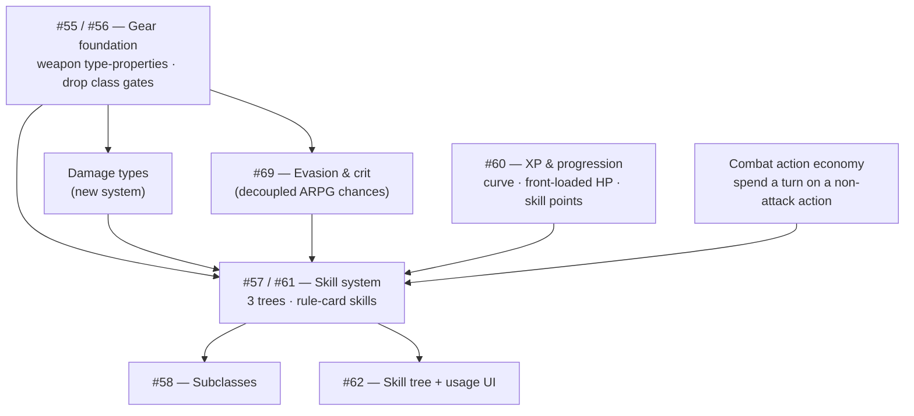

# Design roadmap & decisions — the skill & gear arc

The open design issues (#55–#62, plus the to-hit/defence thread #69) are one interconnected arc. This doc turns it
into a **decision menu**: each row is a discrete piece of work you can
green-light, cut, or shelve. Before green-lighting anything, `game-identity.md`
is the one-page "what this game is / isn't" anchor — the check for whether a
feature fits or drifts toward ARPG / MMO / TTRPG conventions the game doesn't share. Set the **Decision** column (edit this file, or
tell me and I'll record it). Once decided, each **✅ Do** becomes its own small,
pick-up-able issue that **links back to its design issue** — see *Next* at the
bottom.

- **Size:** `S` = small (hours) · `M` = a slice (spec→build) · `L` = a new system/project.
- **Decision:** `✅ do` · `❌ drop` · `⏸ later` · `❓` undecided (default).
- **Notes** carry my engineering read (cheap / keystone / big) — the *gameplay*
  calls are yours and the designer's.

## Dependency graph

## 1. Gear foundation — #55 / #56

**The gear keystone shipped 2026-07-13** (G1+G2+G3, one spec → plan → 4-task
build on `feat/arpg-inventory`): weapons carry tags (melee/ranged/magic) +
`twoHanded` instead of five class-shaped item types; hand slots
(`main-hand`/`off-hand`) replace the per-class weapon-slot pair; every class
equip gate is gone (`wearableBy`/`ErrWrongClass` deleted); the registry's 15
weapons were rebalanced to a "1H ≈ ½ 2H" pass and the Wyrmslayer Greatsword
became the game's first two-handed weapon; combat now resolves every fitting
held weapon as its own hit (dual-wield). Snapshot version bumped 3→4 (old
worlds reject and reset). `docs/FEATURES.md`'s Gear & inventory section and
`docs/rule-based-content-design.md` §4 are the up-to-date reference. G4/G5
(throwables) are **scrapped** (2026-07-14) — throwing isn't a staple ARPG
mechanic, so no thrown content will ship (see the G4/G5 rows and Q1).

| # | Work item | What it is | Size | Notes / deps | Decision |
|---|-----------|-----------|:----:|--------------|:--------:|
| G1 | Weapon type-properties | Weapons carry a *set* of tags (melee/ranged/magic) instead of one `itemType` | M | **Keystone** — unblocks property-skills. `1h` = absence of `2h` | ✅ done (2026-07-13) |
| G2 | Generic hand slots | Drop per-class weapon slots; any weapon fits a hand slot (two-handed greys the other) | M | Pairs with G1 | ✅ done (2026-07-13) |
| G3 | Drop class gear restrictions | Anyone equips anything; class identity comes from skills, not gates (#56) | M | Philosophy shift; designer endorsed | ✅ done (2026-07-13) |
| G4 | Stacking throwables | Javelins/axes stack like consumables; a throw spends one | S | Needs thrown content, which won't ship | ❌ scrapped (2026-07-14) |
| G5 | Multi-mode weapons | One weapon, melee + thrown modes with per-mode damage (the "Kangaroo axe") | L | Built on throwing — **scrapped with G4** | ❌ scrapped (2026-07-14) |

## 2. Damage types

| # | Work item | What it is | Size | Notes / deps | Decision |
|---|-----------|-----------|:----:|--------------|:--------:|
| DT1 | Damage-type system | Every attack/monster carries a damage type; resist/multipliers key on it | L | Unblocks fire gear & skills + the parked Infernal Chain Mail card | ❓ |

## 3. Skills — #57 / #61

| # | Work item | What it is | Size | Notes / deps | Decision |
|---|-----------|-----------|:----:|--------------|:--------:|
| SK1 | Skill rule-card model | Skills as `WHEN/IF/THEN` cards that fold into the combat pipeline | M | Foundation for all passives | ❓ |
| SK2 | Three-tree structure | Class / Adventure / Survival trees, cross-tree independent | M | With SK1 | ❓ |
| SK3 | Property passives | Sharpshooter (+range to ranged), Combat Training (+melee)… | M | Needs G1 | ❓ |
| SK4 | Damage-type skills | Fire Master, Dragon Skin | M | Needs DT1 | ❓ |
| SK5 | Active skills | Targeted actions (target / cost / cooldown) — a new action system | L | New machinery = the **combat action economy** (§8 `ACT`) | ❓ |
| SK6 | Aura / ally-target effects | Healing Aura (buff other players in a radius) | L | New effect targeting | ❓ |
| SK7 | Prerequisites & branching | Skills unlock skills within a tree; capstones | S–M | Part of the tree model | ❓ |

## 4. Progression — #60

| # | Work item | What it is | Size | Notes / deps | Decision |
|---|-----------|-----------|:----:|--------------|:--------:|
| XP1 | Quadratic XP curve | Fast early levels, steep late | S | **Cheap** (formula); independent | ✅ done (fast-lane batch, shipped 2026-07-13) |
| XP2 | Front-loaded HP curve | HP gains fall off with level (replaces linear `HPPerLevel`) | S | **Cheap** (formula); independent | ✅ done (fast-lane batch, shipped 2026-07-13) |
| XP3 | Cut `DamagePerLevel` | A level stops inflating raw weapon damage | S | Defines the "no raw-stat scaling" philosophy | ✅ done (fast-lane batch, shipped 2026-07-13) |
| XP4 | Levels grant skill points | Level-up gives points to spend in trees, not stat bumps | M | Ties #60 ↔ #61 | ❓ |
| XP5 | Anti-rubberband gear rule | High-level gear trades raw stats for modifiers/set bonuses | — | Ongoing content *guideline*, not a discrete build | ❓ |

## 5. Subclasses — #58

| # | Work item | What it is | Size | Notes / deps | Decision |
|---|-----------|-----------|:----:|--------------|:--------:|
| SU1 | Cross-class skill access | Access a *subset* of another tree, gated on a class capstone | L | Needs the skill trees (SK*) | ❓ |
| SU2 | Subclasses, not new classes | Direction: extend via subclasses vs adding whole new classes | — | **Decided: subclasses** (= Q2, 2026-07-13) | ✅ |

## 6. Skill UI — #62

| # | Work item | What it is | Size | Notes / deps | Decision |
|---|-----------|-----------|:----:|--------------|:--------:|
| UI1 | Skill tree UI | View trees, spend points | M | After the model settles | ❓ |
| UI2 | Skill usage UI | Trigger active skills in play | M | Needs SK5 | ❓ |

## 7. Parked gear cards (from the first-batch review)

| # | Work item | What it is | Size | Notes / deps | Decision |
|---|-----------|-----------|:----:|--------------|:--------:|
| P1 | Apprentice's War Mage Robes | 5% cascade extra-hit | M | Needs a cascade-effect system (~SK6) | ❓ |
| P2 | Infernal Chain Mail | Fire resistance (×0.5) | S | Needs DT1 | ❓ |

## 8. Defence, evasion & combat actions — #69

Combat is deterministic today (every attack lands its pipeline-computed
damage). This cluster — surfaced by the #69 discussion — is the newest.
**Combat resolution is ARPG stat-checks, not TTRPG rolls** (decided): defence
and offence are *decoupled* percentage gear stats (`evasion%` / `crit%`), each
a rule card the pipeline folds — never a coupled to-hit roll or `d20`. The
reasoning is in [`combat-model-notes.md`](combat-model-notes.md) ("Were we
mixing TTRPG and ARPG?" / "What if we moved to TTRPG?").

| # | Work item | What it is | Size | Notes / deps | Decision |
|---|-----------|-----------|:----:|--------------|:--------:|
| DF1 | Passive evasion / reduction | Gear rule cards: light = harder to hit (evasion %), heavy = damage-reduction (today's `take-damage -1`) | S–M | The light-vs-heavy split; evasion adds bounded seeded RNG, reduction stays deterministic | ❓ |
| DF2 | Evasion & crit (#69) | Two **decoupled** ARPG chances — `evasion%` (defender dodges → 0 dmg) and `crit%` (attacker deals ×2) | S+L | **Splits:** `crit%` ships as content *today* (elf's `deal-damage`+`chance` pattern — Tier 1, free); `evasion%` is the one new engine event (a 0-dmg dodge can't be a plain card — landed hits floor at 1). Seeded PCG; evasion clamps to a ceiling, crit to `[0,100]` | 🔶 crit% half shipped |

**DF-crit shipped 2026-07-13** (fast-lane batch task 6, #69 Q5): the `crit%`
half of DF2 is no longer just the elf species passive — Misericorde (rogue,
15% → ×2) and Duelist's Saber (fighter, 10% → ×2) are the game's first
**item-side** crit%-weapons, both the same `deal-damage`+`chance`+`mulPct`
rule-card pattern, just carried by gear instead of species. `evasion%`
(the DF2 half needing the new `evasion-check` event) remains unbuilt.
| ACT | **Combat action economy** | Spend a turn's action on a non-attack action | L | **Foundational — unblocks SK5 (active skills), combat-heal (#61), block, protect-ally** | ❓ |
| ACT-B | Block / guard | Active defensive action; **no RNG** | M | Needs ACT; synergises with shields (#55) / Shield Wall (#57) | ❓ |
| ACT-P | Protect an ally | Redirect a hit meant for an ally to you (co-op tank) | L | Needs ACT; new damage-redirect effect (like aura/cascade) | ❓ |

**The `ACT` node re-shapes the arc:** block, combat-heal, protect-ally, *and*
active skills (SK5) are all one system deep — build the action economy once and
they all become reachable. It's the highest-leverage unlock in this cluster.

The two combat-resolution questions raised on #69 (magic / AoE) are decided —
see **Q6** and **Q7** below.

## Open design questions (decide the *how*, not *whether*)

| Q | Question | My input | Decision |
|---|----------|----------|:--------:|
| Q1 | Thrown weapons: lost when thrown, or retrievable? | Moot — thrown weapons scrapped | ❌ scrapped 2026-07-14 (throwing isn't a staple ARPG mechanic; no thrown content will ship — takes G4/G5 with it). Was ⏸ parked 2026-07-12. |
| Q2 | Subclasses or new classes? | **Decided (2026-07-13): subclasses.** A hybrid (spellsword, arcane knight, ranger) = an unlock granting a *subset* of another class's tree; the character keeps its single class. The trio stays protected; no 4th-class costs. Gate per Q11. | ✅ |
| Q3 | One-handed: an explicit tag or the default? | **Decided (#55 walkthrough):** the default — 1H = absence of the `two-handed` tag | ✅ |
| Q4 | What does a level-up give? | **Decided (2026-07-13): one bankable skill point** — spent anytime outside combat (like equip), never a modal pick that could interrupt a bubble; allows banking and >1-cost capstones later | ✅ |
| Q5 | RNG in combat (hit/miss, crits)? | **Decided:** yes, but only as *bounded, decoupled* seeded chances — `evasion%` (defence) and `crit%` (offence), drawn from the per-scope seeded PCG so determinism holds. No coupled to-hit roll, no `d20`. Block / reduction stay deterministic. | ✅ |
| Q6 | AoE hit resolution: per-target, or one roll for all? | **Decided (2026-07-13): neither — AoE always hits.** Evasion applies to *targeted* attacks only; area damage is undodgeable (you dodge attacks, not explosions). Keeps AoE fully deterministic, magic always spectacular (NGB's goal, minus the whole-turn fizzle feel-bad), and creates counterplay: evasion/light armour beats melee & arrows, damage-reduction/heavy armour is the anti-mage answer. `take-damage` cards still apply to AoE. The D&D *save-vs-level* framing stays **rejected** (re-couples attacker/defender). | ✅ |
| Q7 | Do monsters have levels / scale to average player level? | **Decided (2026-07-13): no levels, no scaling.** Kinds + distance rings stay the difficulty model — progress must stay *felt* (the wolf that nearly killed you at L1 dies fast at L5). Ceiling-raising later = **authored variants** (new registry entries that change *behavior/rules*, not just bigger numbers), placed farther out. **Dynamic party-scaling is rejected** — anti-rubberband, and incoherent in a shared world (whose level? stats shifting as friends log in/out; breaks determinism/pinned tests). | ✅ |
| Q8 | Percentage stacking: add or compound? | **Decided: percentages ADD within an event's fold** (sum the `mulPct` deltas, apply once — one truncation, order-independent); **stages compose across events** (deal-damage → take-damage → crit-check), so crit ×2 / damage-reduction stay true multipliers at their own stage. #61 principle 14 holds engine-wide, no carve-out. Small `applyRules` change; single-multiplier results are byte-identical, stacked-mult pinned tests get re-derived. | ✅ shipped 2026-07-13 |
| Q9 | Initial spawn: random scatter or bed/home default? | **Decided (merges both #36 positions):** first spawn = **seeded random scatter *within the sanctuary*** (de-clumps without dropping level-1s into outer rings); **bed thereafter** — spawn at your **last-visited bed** (no bed history), falling back to the sanctuary/Home if the bed is gone. Beds are their own later slice (claimable object + snapshot state → `snapshotVersion` bump); the sanctuary-jitter first spawn is a small `spawnHexLocked` tweak that can ship alone. | ✅ shipped 2026-07-13 (scatter half only — joins AND respawns per `spawnHexLocked`; beds stay future) |
| Q10 | Which skill model governs: plan §0 or the roadmap? | **Decided (2026-07-13): the 3-tree model (B) absorbs the plan's (A).** Class / Adventure / Survival trees per #61; the plan's class-agnostic life skills (First Aid, Make Camp) *are* the Adventure/Survival trees — nothing lost; the Class tree delivers #56's class-identity-via-skills. Plan §0 amended in place. | ✅ |
| Q11 | Subclass capstone-gating vs #61 principle 5? | **Decided (2026-07-13, direction — principle-5 scoping awaits NGB's nod):** the capstone gate **stays**; principle 5 is **scoped to the three standard trees** (Class/Adventure/Survival stay mutually independent — its clear intent). A subclass tree is *locked bonus content*: unlocking it via your class capstone is an unlock, not blocked progression. A flavor deed/quest may *accompany* the capstone in the eventual spec. | ✅ |

## Fast lane (independent of the big arc)

If you want momentum without committing to the whole skill arc, these ship on
their own: **XP1/XP2** (curve + HP formulas) and **XP3** (cut
`DamagePerLevel`). Small, satisfying, no dependencies.

**Batch 1 shipped 2026-07-13**: XP1, XP2, XP3, Q8 (additive fold), Q9's
scatter half (sanctuary-scatter spawn/respawn), and DF2's `crit%` half
(Misericorde/Duelist's Saber) — six independent slices, one commit each.
Every fast-lane item is now shipped or scrapped (G4 throwables — scrapped
2026-07-14).

## Next: turn decisions into issues

Once the **Decision** columns are set, each **✅ Do** becomes its own small
GitHub issue that:
- links back to its design issue (#55–#62),
- states a one-line scope + its dependencies (so it's pick-up-able one at a time),
- and (for `⏸ later`) goes to a parked list instead.

Then work proceeds one issue at a time via **spec → plan → review → build**.

_This is a decision aid. The gameplay calls are yours and the designer's._
